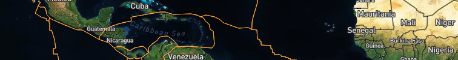
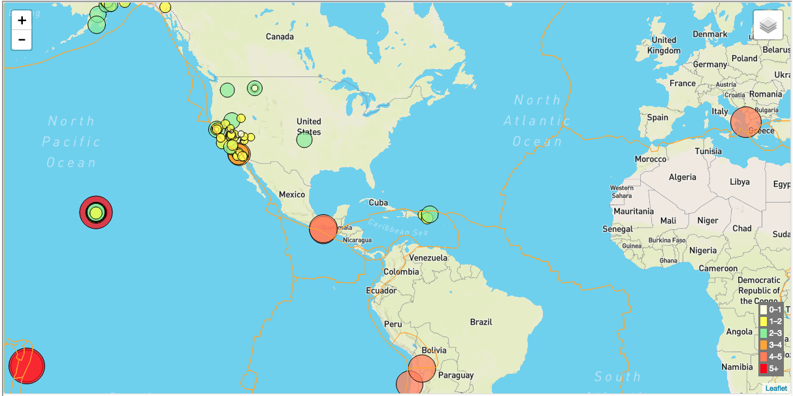
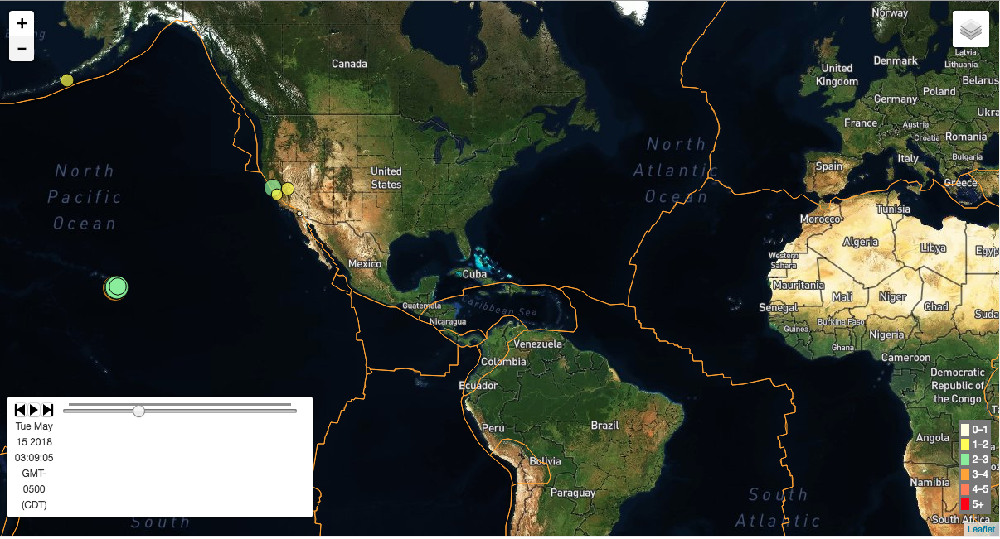

# QuakeGeoData

This project analyses the Earthquake data from the [USGS Earthquake feed](https://earthquake.usgs.gov/earthquakes/feed/v1.0/geojson.php) and shows interractive map visualizations for the earthquakes that have occured in the past 7 days.

## Data
### Earthquake data:
The data for the earthquakes is in the GeoJSON format retrieved from the USGS website.

### Tectonic plates data
The data for the tectonic plates/fault lines is taken from the [Fraxen Github page](https://github.com/fraxen/tectonicplates). This data is also in the GeoJSON format.

## Technology
The project is done using D3.js, Leaflet, Javascript, and HTML

## Website
You can view the project on the [QuakeGeoData Girhub Page](https://rupalimayekar.github.io/QuakeGeoData/). Below are some screen shots of the project website.

### Static Map Visualization
The static map shows two layers on a base map. The earthquakes layer is plotted as circles on their point of location on the map. The size of the circles is proportionate to the magnitude of the earthquake. The circles are also color coded by magnitude. There is also the fault lines that are plotted on the map as a seperate layer that can be turned on or off using the layer control. The map layer can be selected from different map options - satellite/ourdoor/gray scale map.

### Timeline Map Visualization
The timeline map shows the same earquake data on one of the three selected map layer, as an animated map where the circles are plotted as the earthquake occur on a timeline. The circles pop up and disappear in the order of occurrence on the timeline.

